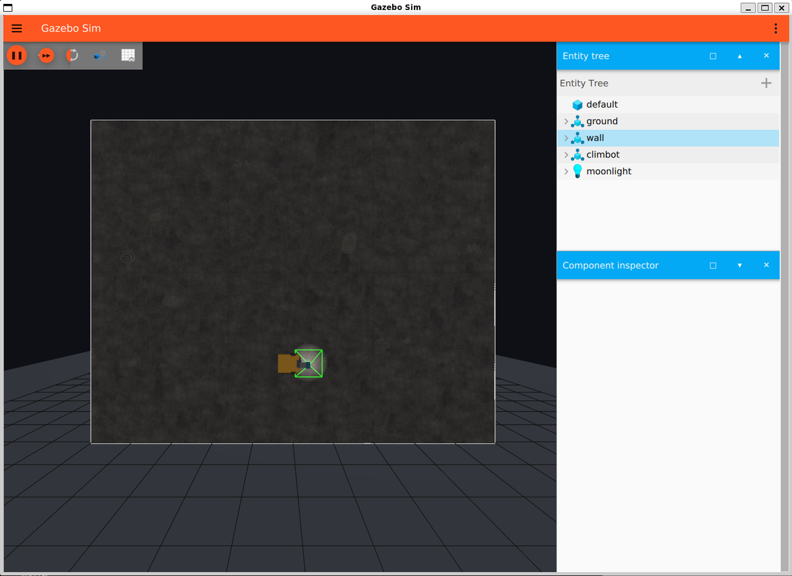

# Climbot Sim

基于 ROS 2 Jazzy 和 Gazebo Harmonic 的垂直壁面爬壁机器人仿真项目。机器人
保留真实重力，通过持续法向吸附力贴墙，以前置差分主动轮和后球形随动轮运动，
并模拟运动时受重力影响的侧滑。

当前已经完成物理仿真、定位融合、覆盖路径规划、多段覆盖 Action、自定义直线跟踪、
转向下坠处理和速度安全链，不使用 Nav2。横向与竖向弓字任务共用控制器：转后小
偏差冻结为平行扫描线，较大偏差先执行一次前进小弧线，正式扫描段始终保持直线。
工业面阵相机按 `mono8` 灰度输出，支持真实 Brown 镜头畸变、弱光单 LED 照明、人工
单拍和沿正式扫描线按位置自动拍摄；每张图像绑定曝光时刻的融合相机位姿与航向，
前后、左右名义重叠均为 `25%`。

直线段有两种可切换的控制律：按剩余距离制动的位置控制，和按时间参数化速度曲线
行驶的时间点控制。两者验收指标等价，后者额外给出任务时长预测：长覆盖任务误差约
`2%`，单段短任务和复杂起点进入仍有 `8%~17%` 的模型偏差（见
[docs/STATUS.md](docs/STATUS.md)），用 `planned_total_s` 排工期时要按这个口径看。



Gazebo 里的作业面与机器人：真实重力，靠持续法向吸附力贴墙，前置差分主动轮加
后球形随动轮。车头的深色标记用来分辨朝向。

## 文档导航

| 文档 | 用途 |
| --- | --- |
| [PROJECT_GUIDE.md](PROJECT_GUIDE.md) | 项目目标、设计约束、实施阶段和最终验收标准 |
| [docs/ACCEPTANCE.md](docs/ACCEPTANCE.md) | §14 每项要求到自动化测试、Gazebo 结果与实机待办的映射 |
| [docs/ARCHITECTURE.md](docs/ARCHITECTURE.md) | 包职责、依赖方向、配置归属和运行时数据流 |
| [docs/INTERFACES.md](docs/INTERFACES.md) | launch、话题、服务、参数和 TF |
| [docs/OPERATION.md](docs/OPERATION.md) | 操作手册：启动、点选、面板、算法切换和回归 |
| [docs/STATUS.md](docs/STATUS.md) | 阶段完成度、review 闭环和下一步 |
| [results/README.md](results/README.md) | 实验结果用途、有效性和重新生成方法 |

## 软件基线

- ROS 2 Jazzy；
- Gazebo Harmonic / gz-sim 8；
- `robot_localization`；
- C++17 用于核心规划和控制；
- Python 用于 launch、传感器适配、实验和数据分析。

## 工作区结构

```text
climbot_sim/
├── PROJECT_GUIDE.md             总指导规范
├── README.md                    项目入口、安装与构建
├── docs/                        操作手册、架构、接口和状态
├── tools/                       并行回归脚本
├── results/                     可追溯实验输出
└── src/
    ├── climbot_description/     共享机器人与墙面描述
    ├── climbot_gazebo/          仿真、定位与评估工具
    ├── climbot_interfaces/      覆盖任务消息与执行 Action
    ├── climbot_coverage/        C++ 覆盖规划与 RViz
    ├── climbot_rviz_plugins/    RViz 操作面板
    ├── climbot_control/         C++ 轨迹跟踪和速度安全
    ├── climbot_inspection/      C++ 单拍、沿轨位置触发与曝光位姿关联
    └── climbot_bringup/         整系统组合 launch
```

依赖方向为：

```text
                climbot_bringup（只有组合 launch）
      ┌───────────────┬┴───────────────┬────────────────┐
      ↓               ↓                ↓                ↓
climbot_coverage  climbot_control  climbot_gazebo  climbot_inspection
      │                │                │
      ├──> climbot_interfaces <──┤       │
      └──> climbot_description <─┴───────┘
```

规划器和控制器都不读取 Gazebo 真值或仿真专有参数；Gazebo 包仅因仿真组合 launch
依赖控制包。组合入口集中在 `climbot_bringup`，它点名下游各包而没有任何包依赖
它，因此算法包的依赖表里不会出现启动编排带来的依赖。

## 环境安装

本仓库当前在以下环境上验证通过：

| 组件 | 版本 |
| --- | --- |
| 操作系统 | Ubuntu 24.04.4 LTS（WSL2，内核 `6.18` microsoft-standard） |
| ROS 2 | Jazzy Jalisco |
| Gazebo | Harmonic / gz-sim `8.11.0` |
| Python | `3.12.3` |
| 构建工具 | `colcon`（`python3-colcon-common-extensions`） |

### 1. 添加 ROS 2 apt 源并安装 Jazzy

apt 源的添加方式以
[官方安装文档](https://docs.ros.org/en/jazzy/Installation/Ubuntu-Install-Debs.html)
为准（本机使用的是 `ros2-apt-source` deb 方式）：

```bash
sudo apt update && sudo apt install -y curl
export ROS_APT_SOURCE_VERSION=$(curl -s \
  https://api.github.com/repos/ros-infrastructure/ros-apt-source/releases/latest \
  | grep -F "tag_name" | awk -F\" '{print $4}')
curl -L -o /tmp/ros2-apt-source.deb \
  "https://github.com/ros-infrastructure/ros-apt-source/releases/download/${ROS_APT_SOURCE_VERSION}/ros2-apt-source_${ROS_APT_SOURCE_VERSION}.$(. /etc/os-release && echo $VERSION_CODENAME)_all.deb"
sudo apt install -y /tmp/ros2-apt-source.deb
sudo apt update
sudo apt install -y ros-jazzy-desktop python3-colcon-common-extensions python3-rosdep
```

需要 `ros-jazzy-desktop` 而不是 `ros-base`，因为点选和预览依赖 RViz2。

### 2. 安装本仓库声明的依赖

**不需要单独添加 `packages.osrfoundation.org` 源。** Gazebo Harmonic 由
`ros-jazzy-gz-sim-vendor` 和 `ros-jazzy-gz-tools-vendor` 随
`ros-jazzy-ros-gz` 一并从 packages.ros.org 装入，`gz` 命令在 source 之后可用。

```bash
sudo rosdep init      # 只需一次，已初始化过会报错，可忽略
rosdep update

cd ~/robot_ws/climbot_sim
source /opt/ros/jazzy/setup.bash
rosdep install --from-paths src --ignore-src --rosdistro jazzy -y
```

该命令会按各包 `package.xml` 装齐 `ros_gz`、`robot_localization`、
`teleop_twist_keyboard`、`rviz2`、`xacro`、`robot_state_publisher`、
`python3-yaml` 和 `python3-matplotlib`。想先看会装什么，把 `-y` 换成
`--simulate`。

### 3. 验证

```bash
source /opt/ros/jazzy/setup.bash
gz sim --versions        # 应输出 8.x
ros2 doctor --report | head -20
```

## 构建与测试

```bash
source /opt/ros/jazzy/setup.bash
colcon build --symlink-install
source install/setup.bash
```

运行全部测试：

```bash
export COLCON_DEFAULTS_FILE=$(pwd)/colcon_defaults.yaml   # 打开并行,见下
colcon test
colcon test-result --verbose
```

`colcon_defaults.yaml` 只做一件事:`ctest-args: ['-j8']`。不设这个环境变量也能跑,
只是串行,慢六倍。等价写法是 `colcon test --ctest-args -j8`。

**并行是安全的,因为每个 launch 测试独占一个 `ROS_DOMAIN_ID`**(见各包
`CMakeLists.txt`)。它们都在众所周知的话题名上启动真实节点,共用一张 ROS 图时会
互相串台——不只是并行才有问题:一个没退干净的残留节点就足以让下一个测试锁到错误
数据,这在本仓库真实发生过,并且差点被误判成规划器回归。改动构型时**不要让两个
测试共用同一个域号**。

| 全量耗时 | |
| --- | ---: |
| 串行 | `75 s` |
| 并行 | `42 s` |
| 并行 + 执行器跑仿真时间 | **`11 s`** |

`test_coverage_executor.py` 曾占全量的一半(`38.8 s`)。它现在让跟踪器运行在
`use_sim_time` 下、由测试自己发布 `/clock` 并以 `10×` 推进:控制环仍是 `50 Hz`
**仿真时间**,所有超时也仍以仿真秒计,只是墙钟等待没有了。

## 启动

一条命令启动仿真、规划器、RViz、跟踪器和任务管理器：

```bash
source /opt/ros/jazzy/setup.bash
source install/setup.bash
ros2 launch climbot_bringup coverage_mission.launch.py
```

在 RViz 的 `Publish Point` 工具下点选区域角点，然后用左侧 **Coverage Task**
面板的 Start 按钮执行。


一次执行中的梯形纵向覆盖任务。图中：

- **左下角的坐标轴**是墙面工作系原点，在墙面左下角：`X` 向右、`Y` 向上，点选和
  所有任务坐标都用这套；
- **灰色方块**是 `10 × 8 m` 的作业面，上面 `1 m` 一格的参考网格线由
  `Wall Reference Grid` 显示项画，随时可勾掉；Gazebo 墙面上那套是另一个开关，见
  [docs/OPERATION.md](docs/OPERATION.md)；
- **绿框**是墙面按机器人安全边距内缩后的可达区域，从启动起常驻，点必须落在里面；
- **橙色四边形**是作业区域，`A`/`B`/`C`/`D` 是四个顶点。梯形只需点三下——
  `A` 左下、`B` 右上、`C` 右下，`D` 由这三点定出来；
- **蓝色折线**是规划出的弓字扫描路径，机器人正走在 35 段中的第 18 段；
- 左下面板给出区域形状、扫描方向、直线控制算法、进度，以及 `Schedule` 一行的
  任务总时长、预计剩余和相对时间表的滞后。任务执行中，改变规划的五个控件
  （Region、Sweep、Algorithm、Replan、Clear points）连同 Start 一起置灰，只有
  Cancel / Stop 可点；
- **Task** 一行是 `rviz-selection`。点选模式下形状由面板在运行时决定，所以任务
  标识只说明区域从哪来，不声称它是什么形状。

只看仿真、只预览规划、参数式演示、切换扫描方向与控制算法、批量回归，以及面板
每一行的含义，见 **[docs/OPERATION.md](docs/OPERATION.md)**。


## 当前状态

- 阶段 A：基础物理与机器人模型——完成；
- 阶段 B：运动侧滑——完成；
- 阶段 C：传感器与定位融合——完成；
- 阶段 D：覆盖路径规划——完成；
- 阶段 E：自定义轨迹跟踪——完成（规范八项全部实现并有归档证据：多段 Action、动态换道、转后平行扫描、小弧线入轨、时间点控制，以及远距离起点进入与不可进入安全停车）；
- 阶段 F：系统测试与数据评价——仿真阶段完成（§14 逐项映射见 [docs/ACCEPTANCE.md](docs/ACCEPTANCE.md)，正式批次与指标见 [results/README.md](results/README.md)；实机阈值和硬件急停仍待实机冻结）。

详细证据和待办见 [docs/STATUS.md](docs/STATUS.md)。

## 安全提示

Gazebo DiffDrive 会持续执行最后收到的 `/cmd_vel`，因此仿真 launch 始终启动速度
看门狗，并由它作为 `/cmd_vel` 的唯一发布者。键盘、实验脚本和自动控制统一发布到
`/control/cmd_vel`；当前一次只能运行一个上游控制源，不要同时启动键盘和自动任务。

控制环和看门狗的定时器**不使用节点默认时钟**，因为系统时钟在 WSL2 下会往回跳，
建在它上面的定时器在回跳期间不触发。详见
[docs/OPERATION.md](docs/OPERATION.md) 的"安全提示"和
[docs/INTERFACES.md](docs/INTERFACES.md) 的"控制环时钟"。
