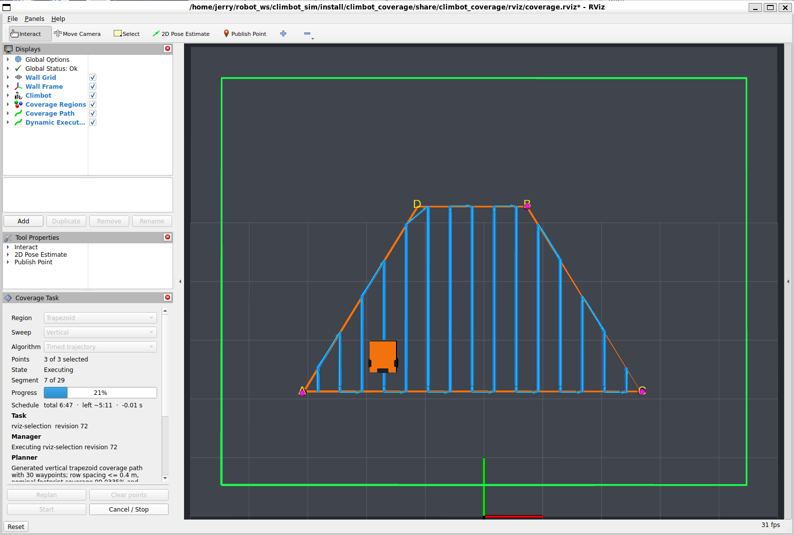

# 操作手册

从零启动一次覆盖任务需要知道的全部内容。包边界和数据流见
[ARCHITECTURE.md](ARCHITECTURE.md)，话题、服务和参数的完整清单见
[INTERFACES.md](INTERFACES.md)，安装与构建见
[README](../README.md)。

以下所有命令都假定已经 source 过环境：

```bash
source /opt/ros/jazzy/setup.bash
source install/setup.bash
```

## 只看仿真

启动墙面、机器人、传感器和 EKF：

```bash
ros2 launch climbot_gazebo climbot_wall.launch.py
```

WSL2 默认自动使用 Mesa D3D12 GPU 后端。自动检测不符合当前环境时可以指定：

```bash
ros2 launch climbot_gazebo climbot_wall.launch.py gpu_backend:=wsl_d3d12
```

Gazebo 的物理／传感器 server 与 GUI 是独立进程：GUI 因 WSLg OpenGL context 创建失败而退出时，
仿真和 ROS 节点仍继续运行；可在修复显示环境后单独执行 `gz sim -g -v 3` 重新连接。只有
server 退出才会受控关闭整套 launch。标准 launch 还会以独立进程组监督两个 Gazebo 客户端；
Ctrl+C 先由监督器接收，再以 `SIGTERM` 结束整个客户端组，避免 GZ 8/Ogre 直接处理 `SIGINT`
时崩溃，或 Ruby 启动器退出后遗留真正的 `gz sim` 子进程。

本仿真默认是**夜间、弱月光环境**：一束 `lighting.moonlight`（强度 `0.30`）提供真实、
可投影阴影的月光；机器人支架 LED 是更强的相机主照明。两者均是实际场景光，相机也会看到，
因此 G3/G4 图像验收应记录其数值，修改后须重新生成平场标定，不能把它误认为纯 GUI 显示设置。
相机视锥已验证不含机器人、支架或灯具；仍须通过带贴图实拍确认平整墙面的正常原图不出现可见
阴影。世界还带有位于墙脚下方 20 mm 的静态中性灰地面，供操作者观察空间关系；它不会改变墙面
上的轮子接触。

键盘控制在另一个终端运行：

```bash
ros2 run teleop_twist_keyboard teleop_twist_keyboard --ros-args \
  -r /cmd_vel:=/control/cmd_vel \
  -p speed:=0.15 -p turn:=0.8
```

机器人初始朝墙面水平方向。水平行驶时应在重力作用下逐渐下降，停车后由静摩擦
基本保持高度。

只要预览规划、不需要执行：

```bash
ros2 launch climbot_bringup coverage_sim.launch.py
```

使用独立规划器或等腰梯形的命令见
[climbot_coverage/README.md](../src/climbot_coverage/README.md)。

## 完整任务：点选区域并执行

一条命令启动仿真、规划器、RViz、跟踪器和任务管理器：

```bash
ros2 launch climbot_bringup coverage_mission.launch.py
```

上述两个 bringup 入口默认同时启动 G1 相机单拍服务。RViz 的 Displays 中
`Inspection Camera` 保持订阅，调用一次：

```bash
ros2 service call /inspection/capture_once climbot_interfaces/srv/CaptureOnce '{}'
```

成功响应（`success: true, reason: 0`）表示一对同时间戳的畸变原图和 `CameraInfo` 已发布，
不只是触发消息已发出。临时状态用稳定的 `reason` 枚举报告：预热 `1`、忙 `2`、排空迟到帧
`3`、本次超时 `4`；不要依赖返回文案。`/inspection/capture_reset` 可人工重新开始排空期，
但不会绕过排空而立即曝光。
相机空闲时不连续出图。只做非视觉调试可在 launch 后加 `inspection:=false`；拍墙面
纹理时还应加 `wall_grid_spacing:=0`。

正式相机图像编码为 `mono8`。默认视觉场景是弱环境光加支架上的单 LED 射灯，原始图
应当中心较亮、四角平滑变暗，但整幅图内不能看见光锥硬边或机器人结构；当前光心
外参为 `[0.340, 0.000, 0.275] m`。彩色 Ogre2 帧只在仿真内部用于材质和光照计算，
不得作为巡检业务图发布。

提交含真实相机足迹的覆盖任务后，自动采集节点会在每条正式 SCAN 上按相机中心的
实际沿轨位置触发，不依赖时间表。每张图在 `/inspection/capture_metadata` 发布同时间戳
的任务 ID、版本、段号、触发号、曝光时刻相机融合位姿和墙面航向。有效足迹为
`0.500 × 0.28125 m`；横向扫描带的 `overlap_ratio` 与纵向拍照的
`image_overlap_ratio` 是两个独立参数，默认均为 `20%`。因此名义横向行距为
`0.400 m`，纵向触发间距为 `0.225 m`。G2 实际重叠验收下限为 `15%`，即纵向曝光
中心间距不超过 `0.2390625 m`、横向扫描中心线间距不超过 `0.425 m`；实际间距仍会
被记录并验收。
每条正式扫描线冻结后，系统以该线实际长度 `L` 和间距
`s = detection_length × (1 − overlap)` 生成 `ceil(L / s)` 个位置触发点；最后一点
保留在终点前一个间隔内，避免控制器在终点容差内完成而漏掉理论端点帧。记录器使用同一
冻结参考和同一公式核对归档数，名义规划航点数量只用于任务开始前的磁盘容量预留。
因此 Capture 页会同时显示：**Nominal**（开始前的全任务容量预估，任务期间不变）和
**Frozen**（已实际冻结的 SCAN 参考累计拍摄计划，第一条扫描线后从零开始逐条增长）。
例如 `22 frozen / 132 nominal` 不是任务缩短为 22 张，而是 132 张任务中目前只有首条线的
22 张已按实际执行参考确定；全部扫描线冻结后 Frozen 才是最终必须与已保存数严格相等的数。
巡检与普通覆盖任务均使用 `0.20 m/s` 巡航。全站仪默认仍为 12 Hz、1 mm 噪声和 10 ms
固定传输延迟；由此产生的曝光位姿误差保存到标签并由离线拼接处理，不通过在线限速掩盖。

轴向验收时可临时显示非对称靶；正常巡检不要打开：

```bash
ros2 launch climbot_gazebo climbot_wall.launch.py \
  inspection_target:=true wall_grid_spacing:=0 headless:=true
```

红色块表示机器人前进正向，应出现在图像上方；绿色块表示墙面向上，应出现在图像
左侧；蓝色块是投影中心。靶标默认关闭，不会混入普通墙面图像。

### 弱光平场标定

先以纯灰板启动仿真和巡检单拍节点，再采 30 张独立曝光：

```bash
ros2 launch climbot_gazebo climbot_wall.launch.py \
  headless:=true inspection_flat_field_target:=true wall_grid_spacing:=0
ros2 launch climbot_inspection inspection.launch.py \
  use_sim_time:=true automatic_capture:=false
ros2 run climbot_inspection calibrate_flat_field --ros-args \
  -p output_file:=/tmp/climbot_flat_field.npz -p frame_count:=30
```

成功日志必须同时显示 `frames=30 unique_stamps=30 unique_hashes=30` 和非零
`noise_dn`。正常纹理墙重启后，通过
`inspection.launch.py flat_field_file:=/tmp/climbot_flat_field.npz` 发布
`/inspection/camera/image_compensated`；原图仍保留。曝光、LED、相机或镜头参数改变后
必须重新标定。`simulation.inspection_camera.exposure_scale` 是 Gazebo 没有原生曝光控制时的
相对积分时间（仅允许不大于 1 的短曝光）；标定会拒绝饱和像素比例超过 `0.01%` 的原始灰板帧。

完整任务可直接传入持久化标定文件；它只发布补偿预览并写入归档的标定引用，`images/raw/`
仍是未经畸变或光照补偿的原始帧：

```bash
ros2 launch climbot_bringup coverage_mission.launch.py \
  flat_field_file:=/home/jerry/climbot_data/calibration/flat_field_sim_moonlight_led2_exp065_20260825.npz
```

仿真默认纯灰板目标均值为 `172.75 DN`；它在当前 LED／短曝光组合下复现混凝土补偿图约
`86 DN` 的既有亮度，并保留高亮余量。可用 `-p target_mean_dn:=...` 调整，范围为 `1～254 DN`。

### 点选机器人任务可走区

RViz 从启动起显示**绿色虚线框**，它是墙面按机器人安全边距内缩后的绝对安全区。
用户点击的矩形或等腰梯形表示机器人执行扫描时的名义可走区，而不是必须完整拍到的墙面
目标；任一点或自动补出的梯形顶点落在绿框外都会被拒绝。

工作系的原点在墙面左下角，所以坐标全是非负的：`10 × 8 m` 的墙面配上
`safety_margin = 0.5 × hypot(0.76, 0.475) + 0.10 = 0.548 m`，绿色虚线框就是
`x ∈ [0.548, 9.452]`、`y ∈ [0.548, 7.452]`，机器人出生在 `(5.0, 2.0)`。

完成点选后，橙色实线显示任务可走区，蓝色实线显示完全位于橙区内的机器人中心路径，
黄色半透明带显示相机预计扫掠覆盖。黄色由蓝线、`0.340 m` 前置外参和
`0.500 × 0.28125 m` 有效视场计算，可能伸出橙区，也可能因交替扫描和梯形斜边呈不规则
边缘。启动未规划时没有黄色，因为那时还没有扫描线可供推导。

墙面上和 RViz 里都画着 `1 m` 的**参考网格线**。线落在工作坐标的整数倍上、只画
内部线，两个视图用的是同一条规则和同一个间距（`climbot_description/config/wall.yaml`
的 `reference_grid.spacing_m`），所以从任一视图读出来的坐标一致。

两套网格各有各的开关，互不影响：

| 要关的 | 怎么关 |
| --- | --- |
| **Gazebo 墙面上那套**（会进照片） | 启动时加 `wall_grid_spacing:=0` |
| **RViz 叠加层**（只有人看） | Displays 里取消勾选 `Wall Reference Grid`，当场生效 |

```bash
ros2 launch climbot_bringup coverage_mission.launch.py wall_grid_spacing:=0
```

`wall_grid_spacing` **只管墙面那套**，不碰 RViz。拍摄墙面的运行必须加它——网格线是
周期性高对比特征，还浮在墙面前 `3 mm`，在 `0.50 × 0.28 m` 的拍摄视场下会进入 `67%`
的照片。而这类运行操作员照样要看规划，所以 RViz 那套不能跟着一起消失。

在工具栏选择 `Publish Point`，按下表顺序点击角点。每次点击 `/coverage/status`
都会回显它认成了哪个角和坐标，用来确认没有因为相机视角而选反方向：

| 区域 | 点击顺序 |
| --- | --- |
| `rectangle`（默认） | A 左下 → B 右上 |
| `trapezoid` | A 左下 → **B 右上** → C 右下 |

梯形第二下是右上、第三下才是右下，容易顺手点成逆时针。手点两个底角不可能等高，
规划器会取均值，差超过 `bottom_warning_tolerance`（默认 `50 mm`）时状态里会多一句
`Bottom clicks differed by ... and were corrected to their mean height.`，这是提示
不是错误。

最后一次点击后 RViz 中出现规划路径，左侧 **Coverage Task** 面板的 State 变为
`Ready` 并显示任务名与 revision。

### 面板



面板上方公共区始终显示 State、Segment、Progress 和 Inspection 摘要；中间页签分别为
`Plan`、`Capture`、`Details`，底部的 Start 与停车按钮不随页签滚动。

| 页签／行 | 内容 |
| --- | --- |
| **Plan** | Region、Sweep、Algorithm、点选状态、Replan 与 Clear points |
| **Capture** | 本次任务的原图归档开关、记录器端根目录、名义总预计／已冻结实际计划／已保存／失败数量、最终目录和归档状态 |
| **Details** | Task、Schedule、Manager、Planner 与 Last request |

| 按钮 | 作用 |
| --- | --- |
| **Start** | 开始执行，State 转为 `Executing` |
| **Cancel / Stop** | 中途停车 |
| **Force abandon** | 仅在 Start 应答永久未知时才显示；5 秒内二次点击后进入恢复锁，不代表任务已停止 |
| **Rearm after verification** | 仅在恢复锁时显示；确认硬件急停、驱动失能、执行器确已终止，或 hold 解除等待已安全收回后解除恢复锁 |
| **Clear points** | 点错角点时清空重选 |
| **Replan** | 用当前角点重新规划 |

**任务运行期间，Plan 页的五个规划控件以及 Capture 页的开关和根目录全部置灰。**
正常运行中只保留 Cancel；仅在异常恢复状态才显示并开放 Force abandon 或 Rearm。这些规划
控件发出的请求确实只改预览、不动正在执行的 Goal，但预览就是画在机器人身上的那条轨迹，
运行中改它看起来就像任务被换掉了。

Start、Cancel、Force abandon 和 Rearm 的置灰由管理器发布的许可位决定；恢复锁和
运行期间五个规划控件都置灰，不是面板另外判断一遍任务状态。无论面板显示什么，
非法请求都由管理器拒绝，原因显示在 Last request 一行。

### 任务级原始图像归档

默认启动的完整 `coverage_mission` 开启采集。规划完成后在 `Capture` 页确认
**Capture raw images** 和记录器端根目录（默认 `~/climbot_data`），再按 Start。该服务
只表示“归档准备请求已受理”：管理器先让记录器检查目录、标定和可写性，成功后才向
执行器发送运动 Goal。运行目录、计数和故障以公共区／Capture 页中的任务状态为准。

Start 后开关和根目录冻结，直到任务完成、取消或归档失败后封存。取消准备阶段不会让
机器人运动；记录器若迟到返回，管理器仍会将那次独立归档取消，不能把任务重新变为
可执行。运行中归档失败会请求受控停车。归档只保存畸变 `mono8` 原图、同曝光标签和
标定／任务 manifest；补偿图只用于预览。目录结构和离线处理边界见
[接口规范](INTERFACES.md#G4-任务归档接口)。

若 State 显示 `Stopping` 且管理器一直等待未知的 Start 应答，默认保持这个状态最安全。
只有已经从机器人外部确认停车条件时才使用 Force abandon：第一次点击只显示风险，
5 秒内第二次点击才进入 `Recovery locked`。这一步仍不开放 Start；完成硬件/执行器确认
后再点击 Rearm。不要把这两个按钮连成自动脚本，ROS hold 不能替代实机硬件急停。

几个容易踩的点：

- 取消或跑完之后 **Start 仍然可用**，再按一次就重跑同一个任务；
- 点选模式下**没选够点时 Replan 会被拒绝**，因为配置文件里的角点仍在，否则会规划
  出一块没人选过的区域；
- Planner 一行显示规划器自己的状态——规划失败和"没选区域"在管理器看来都是空任务，
  只有这一行能区分。

面板由 `climbot_rviz_plugins` 提供，已写入 `coverage.rviz`，随 launch 自动出现；
若被关掉，用 RViz 菜单 `Panels → Add New Panel → climbot_rviz_plugins/Coverage`
恢复。排版细节见
[`src/climbot_rviz_plugins/README.md`](../src/climbot_rviz_plugins/README.md)。

同样的操作也可以走命令行，两者等价：

```bash
ros2 service call /coverage/start std_srvs/srv/Trigger
ros2 service call /coverage/cancel std_srvs/srv/Trigger
ros2 service call /coverage/force_abandon std_srvs/srv/Trigger
# 完成外部停车确认后才执行：
ros2 service call /coverage/rearm std_srvs/srv/Trigger
ros2 service call /coverage/clear_points std_srvs/srv/Trigger

# 只看人类可读的一行
ros2 topic echo /coverage/manager_status --field message

# 完整状态：state、task_id、revision、current_segment/total_segments、progress、
# 以及 planned_total_s / schedule_lag_s / estimated_remaining_s
ros2 topic echo /coverage/manager_status
```

### Schedule 一行怎么读

```text
Position only      total 6:30  ·  left ~4:12  ·  estimate only
Timed trajectory   total 6:30  ·  left ~4:12  ·  +0.04 s
```

- **total** 是任务开始时算定的预计总时长，全程不变，含到第一个路点的接近段；
- **left** 每周期更新，并带上当前累计滞后，所以落后时它会变长而不是匀速递减；
- 末尾一项区分两种模式：
  - `Timed trajectory` 显示**相对时间表的滞后**，正数为落后、负数为超前。跑直线时
    实时变化，转向和对准阶段停在 `0.00`（那时没有直线时间表在跑），每段开始重新
    起算。正常运行在几个百分之一秒量级。
  - `Position only` 显示 `estimate only`。这不是说这个数不准——时长模型的每段开销
    常数本来就是从位置控制的运行数据标定的——而是说**没有任何东西执行或监测它**：
    机器人打滑超出模型假设时不会有人纠正，也不会上报，只会悄悄迟到。

进度条和 Schedule 回答的是两个不同问题：进度条说**做完了多少工作量**，机器人卡住
时它就不动；Schedule 说**跟不跟得上计划**。所以两者刻意分开，没有把时间折进
进度条。

### 切换区域形状与扫描方向

面板上的 **Region** 和 **Sweep** 两个下拉框直接切换，不用重启 launch。

- **切换形状会撤掉当前预览。** 轨迹消失，需要按 **Replan** 用现有点重建，或
  **Clear points** 重新选。下拉框是在问"这些点是什么形状"，不是在下令规划——
  梯形 3 点切回矩形时它曾经悄悄按前 2 点画出一条谁也没要求过的新轨迹。
- **切换形状不丢点。** A、B 在两种形状里是同一个角，所以矩形选好 2 点切到梯形只
  等第 3 点。丢点会让下拉框上的一次误点变成不可逆操作。
- **切换扫描方向不撤预览**，它不改变区域本身，只是换个方向画同一块地。
- **没选点就切构型**只改构型，不会规划出一块没人选过的区域。
- **请求被拒时下拉框弹回**规划器实际生效的值，不会停在一个规划器从未同意的显示上。

命令行等价写法：

```bash
ros2 service call /coverage/configure climbot_interfaces/srv/ConfigureCoverage \
  "{region_type: trapezoid, sweep_direction: vertical}"

# 只改一项：留空的字段保持不变
ros2 service call /coverage/configure climbot_interfaces/srv/ConfigureCoverage \
  "{sweep_direction: horizontal}"

# 当前构型（latched，后启动的客户端也能拿到）
ros2 topic echo /coverage/config
```

启动时仍可用 launch 参数指定初值：

```bash
# 矩形 + 竖向扫描（点 2 下）
ros2 launch climbot_bringup coverage_mission.launch.py sweep_direction:=vertical

# 梯形 + 横向扫描（点 3 下）
ros2 launch climbot_bringup coverage_mission.launch.py region_type:=trapezoid
```

### 切换直线控制算法

面板上的 **Algorithm** 下拉框在两种直线段控制律之间切换：

| 选项 | `tracking_mode` | 直线段怎么走 |
| --- | --- | --- |
| **Timed trajectory**（默认） | `time` | 按时间参数化的梯形/三角形速度曲线行驶：前馈该时刻的曲线速度与加速度，反馈该时刻应到位置与实际位置之差 |
| **Position only** | `distance` | 恒定巡航速度前进，终点靠 `sqrt(2·a·剩余距离)` 距离制动收尾。控制器不知道"现在应该走到哪儿" |

两者在落点、道间距、转向落点航向和覆盖率上**没有系统性差异**——2026-08-19 在同一
提交的同一棵干净工作树上各跑了八工况，只差这一个参数，单工况互有胜负，差值都落在
运行间散布内。分得开的只有任务时长预测：

| | `act/plan` 区间 | sd | 最大偏离 | 滞后是否被测量 |
| --- | --- | ---: | ---: | --- |
| `time` | `0.988~1.020` | 0.92% | 1.96% | 是，`0.03~0.05 s` |
| `distance` | `0.968~1.016` | 1.43% | 3.18% | 否 |

`time` 是默认值，理由是后一列而不是前几列：它逐拍上报自己与计划的偏差，落后了会
自己说出来；`distance` 只能等任务结束后对账。原地转向段两种模式相同——它本来就是
时间参数化的。实测数据见 [`results/README.md`](../results/README.md)「两种算法的
对照」和 [PLAN_2026-08-18_time_control.md](PLAN_2026-08-18_time_control.md) 第 8 节。

**任务运行中不能切换**，执行器会拒绝并说明原因：控制律换了而时间表还是按旧律排
的，那是危险的。面板在运行期间已经把这个框置灰。

启动时指定（默认已是 `time`，这行是切回位置控制用的）：

```bash
ros2 launch climbot_bringup coverage_mission.launch.py tracking_mode:=distance
```

命令行等价（同样只在没有任务运行时接受）：

```bash
ros2 param set /line_tracker tracking_mode distance
ros2 param get /line_tracker tracking_mode
```

## 对照基线几何

想和 `results/` 中的基线对照，可直接点选基线几何：矩形取
`(0.005, 1.75)`–`(4.305, 3.45)`；梯形取 A `(-0.6, 1.4)`、B `(2.7, 4.2)`、
C `(3.4, 1.4)`，即底边 `4.00 m`、上底 `2.60 m`、高 `2.80 m`。梯形横向约
`232 s`、13 段，梯形竖向约 `284 s`、19 段，竖向工况接近五分钟，不是卡住。

跳过点选、直接用配置里的角点启动同一条链：

```bash
ros2 launch climbot_bringup coverage_mission.launch.py \
  input_mode:=parameters region_type:=trapezoid sweep_direction:=vertical \
  planner_config_file:="$(pwd)/src/climbot_coverage/config/coverage_trapezoid_vertical_demo.yaml"
```

该 launch 的规划器与控制器参数文件分别叫 `planner_config_file` 和
`control_config_file`，不能都写成 `config_file`：被包含的 launch 会继承父作用域的
同名参数，一个 `config_file` 会同时落到两个节点上，使跟踪器退回内置默认值。

## 参数式完整演示

仓库提供矩形和等腰梯形参数式演示：

- `coverage_vertical_demo.yaml`：`3.30 × 4.50 m`，8 条竖向扫描线；
- `coverage_horizontal_demo.yaml`：`4.30 × 1.70 m`，4 条横向扫描线；
- `coverage_trapezoid_horizontal_demo.yaml`：底边 `4.00 m`、上底 `2.60 m`、高 `2.80 m`，横向扫描；
- `coverage_trapezoid_vertical_demo.yaml`：同一梯形，竖向扫描。

以下示例运行横向长扁矩形。终端 1 启动仿真、规划器和 RViz：

```bash
ros2 launch climbot_bringup coverage_sim.launch.py \
  config_file:="$(pwd)/src/climbot_coverage/config/coverage_horizontal_demo.yaml" \
  input_mode:=parameters region_type:=rectangle sweep_direction:=horizontal
```

终端 2 启动覆盖执行器：

```bash
ros2 launch climbot_control coverage_executor.launch.py use_sim_time:=true
```

终端 3 将规划器发布的任务发送给 Action，并用 Gazebo 真值评价轨迹：

```bash
ros2 run climbot_gazebo evaluate_coverage_execution.py --ros-args \
  -p use_sim_time:=true -p case:=planned_task \
  -p startup_timeout_s:=20.0 -p execution_timeout_s:=600.0 \
  -p trajectory_csv:=results/coverage_trajectory.csv.gz \
  -p summary_json:=results/coverage_summary.json
```

竖向演示只需在终端 1 改用 `coverage_vertical_demo.yaml`，并把
`sweep_direction` 改为 `vertical`。评价工具默认的 `120 s` 是整任务等待时间，
大区域演示必须显式提高；它与控制器每段的安全超时不是同一个参数。

## 批量回归

八个验收工况并行跑一轮，每条 lane 用独立的 `ROS_DOMAIN_ID` 和 `GZ_PARTITION`
隔离：

```bash
tools/run_coverage_regression.sh -j 4 -t <tag>              # 默认时间点控制
tools/run_coverage_regression.sh -j 4 -t <tag> -m distance  # 位置控制
```

结果写进 `results/coverage_<case>_<tag>_summary.json` 和同名轨迹 CSV，汇总表附在
命令输出末尾。用途和有效性见 [results/README.md](../results/README.md)。

**跑正式基线前先把 `src/` 提交干净。** 脚本开跑前检查工作树，非干净时自动给标签加
`-dirty` 后缀并打印醒目告警。带 `-dirty` 的结果只能当过程记录。

### 工况有两张表

`CASES` 是八个覆盖工况，经规划器分解区域。`LINE_CASES` 是单段直线和起点进入工况，
**不起规划器**——评价器自己发布两路点任务，被测的是跟踪器在一条线上的表现，而不是
区域分解：

```bash
tools/run_coverage_regression.sh -t <tag> -j 5 \
    line_horizontal line_horizontal_back line_vertical \
    line_diagonal line_diagonal_back                       # §15.7 单段直线
tools/run_coverage_regression.sh -t <tag> -j 4 \
    entry_near entry_mid entry_far entry_side entry_behind \
    entry_vertical_side entry_diagonal                     # 阶段 E 第 8 项起点进入
tools/run_coverage_regression.sh -t <tag> -j 1 \
    -o "turn_slip_per_degree_m=0.0" g1_cross               # G-1 初始横轨误差
```

### 扫描用的开关

| 开关 | 含义 | 默认 |
| --- | --- | --- |
| `-s` / `-i` | 全站仪 / IMU 噪声种子 | `42` / `17` |
| `-n` | 全站仪位置噪声 `stddev`，米 | `0.001` |
| `-r` | 全站仪发布频率，Hz | `12.0` |
| `-d` | 全站仪丢包率 | `0.0` |
| `-o` | 覆盖一个 `line_tracker` 参数，`name=value`，可重复 | 无 |

默认值全部照抄 launch 文件的，所以不带开关跑出来就是普通配置，每个扫描点与基线只差
一个数。`-o` 是拷一份 `control.yaml` 打补丁放进运行目录，不动工作树。

**实际生效的值不靠转述**：评价器启动后向 `total_station_sim`、`wall_imu_adapter` 和
`line_tracker` 的参数服务问回来，写进摘要的 `provenance.noise_sources` 和
`provenance.control_parameters`。传给一个没起来的节点的参数，在摘要里看得出来。

### P2.7b realistic 定位 profile

默认 `precision` 保持既有 `12 Hz`、`1 mm` 位置白噪声和已知 `10 ms` 送达延迟。需要
重新采集诊断墙数据时，以 `realistic` 启动；它的初始可校准参数是机器人系
`[20, -10, 0] mm` 棱镜残差，以及仅作用于观测 header 的 `+20 ms` 时钟偏差和
`2 ms` 零均值抖动：

```bash
ros2 launch climbot_bringup coverage_mission.launch.py \
    wall_texture:=textures/wall_diagnostic_025/wall_texture.json \
    wall_grid_spacing:=0 \
    localization_profile:=realistic
```

棱镜残差按 Gazebo 真值 yaw 投影到墙面坐标，正反向扫描会得到相反的墙面内投影；它不改变
发布协方差。时间戳项不改变送达时间：已知 `10 ms` 队列仍按真实采样时刻送达，而 clock
残差只改 header stamp。若要分开做消融试验，可覆盖任一项：

```bash
# 保留 realistic 的时间戳残差，但关闭棱镜残差
ros2 launch climbot_gazebo climbot_wall.launch.py headless:=true \
    localization_profile:=realistic prism_extrinsic_error_mode:=disabled

# precision 基线中只启用棱镜残差，并指定另一个机器人系向量（m）
ros2 launch climbot_gazebo climbot_wall.launch.py headless:=true \
    localization_profile:=precision prism_extrinsic_error_mode:=enabled \
    prism_extrinsic_error_robot_m:='[0.010, 0.008, 0.0]'
```

`enabled` / `disabled` 显式覆盖 `auto`；时间戳项同理使用
`measurement_timestamp_error_mode`。摘要会通过参数服务写回 profile、两个实际开关、残差、
偏差、抖动和种子，连同 Gazebo 真值／EKF 相机中心误差记录在一起，不能把调参值事后写进
归档标签冒充传感器输入。2026-08-27 的单横向 G2 初步校准（10 张曝光、非正式验收）在
`[20, -10, 0] mm` 下得到 P95 `24.17 mm`、最大 `24.17 mm`；仍必须以新的横向／竖向
正式采集复核，不能将这次短运行或 P95 调试带当作最终门限。

### P2.7c 诊断墙真值评价

拼接完成后，才可用独立评价器把 hard-cut BigTIFF 与诊断墙 DDS 母版的米制特征对齐。它只读取
正式拼接结果、`wall_texture.json` 和 DDS；不得接入候选生成、匹配或位姿图优化：

```bash
ros2 run climbot_mosaic evaluate_diagnostic_mosaic \
  --mosaic-dir /home/jerry/climbot_data/mosaic-p27b-hardcut-joint-20260827 \
  --wall-manifest "$PWD/textures/wall_diagnostic_025/wall_texture.json" \
  --output-dir /home/jerry/climbot_data/mosaic-p27b-hardcut-joint-truth-<new-id> \
  --anchor-padding-m 0.10 --minimum-phase-response 0.10
```

评价器仅采用两个图上都完整可见的修补块／涂鸦锚点；相位相关响应低于门限的锚点被明确拒绝，
两个版本只用同一组保留锚点比较。输出记录绝对锚点偏差、尺度 ppm、航向、局部相似变换残差和
所有锚点的响应。少于三个保留锚点时仍报告整体相似变换，但 `local_residual_observable=false`，
不得把两点刚好拟合的零残差解读为局部无形变。

已构建诊断墙时，可用现成脚本采集两条独立 270 帧轨迹；它使用新任务 ID、永久归档根目录，
且把评价器的旧 `5 mm` 精度上限仅对本次**分布测量**放宽为 `1 m`。因此脚本的 `PASS` 只表示
任务、归档、照片绑定和几何采集合同通过；必须从摘要读取 P95，不能把它解释成 precision
定位验收。

```bash
INSPECTION_OUTPUT_ROOT=/home/jerry/climbot_data \
WALL_TEXTURE=textures/wall_diagnostic_025/wall_texture.json \
LOCALIZATION_PROFILE=realistic G2_MAX_CAMERA_POSITION_ERROR_M=1.0 \
tools/run_g2_inspection_acceptance.sh p27b_horizontal p27b_vertical
```

### §14.5 定位对照

不走回归脚本，单独跑一次四方向闭环，逐段用真值同时测融合位姿误差和轮式航位推算
误差：

```bash
ros2 launch climbot_gazebo climbot_wall.launch.py use_sim_time:=true headless:=true
ros2 run climbot_gazebo evaluate_localization.py --ros-args -p use_sim_time:=true \
    -p summary_json:=results/localization_<tag>_summary.json
```

## 墙面贴图

墙面默认是平色的。贴图是**本地生成**的：源素材 `540 MB`、烘焙产物约 `250 MB`，
两者都不进仓库。仓库里的是脚本、源素材的 `sha256` 和烘焙种子——这三样一起把
产物钉死，因为这张图不只是布景，它是拼接结果要比对的基准，换一版素材就等于换了
一面墙而没人看得出来。

```bash
# 一次性：下载并校验源素材，只解出颜色图（约 540 MB）
tools/fetch_wall_texture.sh

# 烘焙整面墙：40000 × 32000 纹素（0.25 mm/texel），BC1 DDS，mip 链写在文件里。
# 四个编码 worker 保持相同像素与清单顺序；内存紧张时改为 --jobs 1。
python3 tools/bake_wall_texture.py \
    --source-dir "${TMPDIR:-/tmp}/climbot_wall_texture/maps" \
    --output-dir textures/wall --source-size-m 2.5 --jobs 4

# 用它启动
ros2 launch climbot_bringup coverage_mission.launch.py \
    wall_texture:=textures/wall/wall_texture.json wall_grid_spacing:=0
```

`--source-size-m 2.5` 没有默认值，必须显式给：ambientCG 没有记录 `Concrete044D`
的真实尺寸，这个数是**本项目的声明**，而烘焙里每一个长度都是从它推出来的。

默认烘焙使用 `1536 px` quilting patch、`25%` patch 重叠，并在每个 `2048 px`
渲染块四周携带 `128 px` 的真实相邻像素。后一个边框不是重复填充：相邻 visual 会在
同一段墙面坐标上显示同一段整墙图，使双线性过滤、mipmap 和 BC1 采样不会在 DDS
边缘各自钳位成一条接缝。`wall_texture.json` 中分别记录名义覆盖范围和带边框采样范围；
前者仍无重叠、无空洞地覆盖墙面，后者允许 visual 在外观上重叠。旧清单可以继续加载，
但不具备这项接缝保护，要获得新效果必须重新运行烘焙命令。

`128 px` 不是只为原始分辨率准备的。它使相邻块经过五级 2× 下采样及 BC1 的 `4×4`
编码后仍保持相同采样相位，覆盖 Gazebo GUI 从近景到整墙视角通常使用的 mip 范围。
代价是贴图纹素和压缩产物比无边框版本增加约 `24%`，仍在烘焙器的显存预算内。

### P2.7a 诊断墙

`wall_025` 是当前精度／混凝土基线，必须保持不变。以下命令从它的 DDS 块生成一个
**独立**的诊断墙：其中只有少量不规则施工缝、裂纹、修补块和喷涂标记，用来检查拼接
对可人工辨识细节的恢复能力；它不是用于特征算法的密集标定格。

```bash
python3 tools/create_diagnostic_wall.py \
  --base-manifest textures/wall_025/wall_texture.json \
  --output-dir textures/wall_diagnostic_025 \
  --seed 20260827 \
  --preview docs/images/wall_diagnostic_preview.png

ros2 launch climbot_bringup coverage_mission.launch.py \
  wall_texture:=textures/wall_diagnostic_025/wall_texture.json \
  wall_grid_spacing:=0
```

生成器拒绝覆盖已有输出目录。裂缝和白色手绘标记来自透明贴片图集
`tools/assets/diagnostic_wall_decals_v2.png`；v2 裂缝源图本身就是细长、自然分叉且末端渐细的
发丝裂纹。渲染器保留其走势和分叉，在图集原始分辨率上规范中心线后再统一颜色、尺寸、
角度和透明度；最终可见轮廓中位宽约 `4.0 mm`，较实核心中位宽约 `2.8 mm`。清单的 `diagnostic_wall` 段记录输入清单
SHA-256、贴片图集 SHA-256、生成 seed 和每一条特征的墙面米制坐标；所有特征按同一坐标写入相邻 DDS 的重叠 gutter，
因此块边界本身不能制造假接缝。诊断墙仍只是 wall 的视觉层，不改变碰撞、摩擦、
WheelSlip 或控制参数。`textures/` 产物不进 Git，脚本、seed 和 manifest 共同构成可复现
定义。

quilting 仍先在 `384 px` 重叠区寻找最小误差裁切路径，再只在该路径附近做默认
`96 px` 的窄羽化。羽化不会跨出两块真实照片共同覆盖的区域；它用于去掉硬裁切留下的
亮度边，而不是把整个 overlap 模糊成平均图。可用 `--seam-feather-px 0` 生成硬裁切
对照，但正式墙面不使用该模式。

拍照运行请一并加 `wall_grid_spacing:=0`（只关墙面那套，RViz 不受影响），理由见上面
的参考网格线一节。

贴图只改墙面**外观**：碰撞盒、摩擦系数和按它标定的 WheelSlip 参数都不动，贴图块
浮在墙面前 `1 mm`（参考网格线是 `3 mm`，那个距离足以让拼接的单应性把它当成第二个
平面）。

也可以把清单路径写进 `climbot_gazebo/config/simulation.yaml` 的
`wall.texture_manifest` 长期生效；launch 参数优先级更高。路径指向的文件不存在时
launch **直接报错退出**，不会退回平色墙——一整轮拍出来的白墙照片看起来像相机故障，
发现它的代价是整轮重跑。

### 渲染照片验收

`capture_wall_texture.py` 用 Gazebo server 的真实 Ogre2 相机传感器采图，不是从 DDS
离线裁图。相机位姿由共享 `wall.yaml` 与 `simulation.yaml` 推导，完整 Gazebo/bridge
日志和原始 PNG 应放在 `/tmp`，只有小型 JSON 摘要进入 `results/`。

整墙位置可区分性用 `5×4` 个参考位置；每个查询相对参考平移
`(60, 25) mm`、距离扰动 `0.5%`、航向扰动 `±0.6°`，然后对全部参考位置做 ORB +
RANSAC 检索：

```bash
source install/setup.bash
python3 tools/evaluate_wall_texture_photos.py global \
  --manifest textures/wall/wall_texture.json --columns 5 --rows 4 \
  --batch-size 12 --work-dir /tmp/climbot_wall_global_<tag> \
  --output results/wall_texture_global_<tag>_summary.json
```

贴图精度对照不能让三档各自独立 quilting，否则抽到的混凝土内容会与纹素精度混在
一起。先以最细档烘焙一份 canonical，再从其 BC1 mip 0 解码并 LANCZOS 下采样；三档
因此拥有同一内容、同一接缝和同一墙面坐标，只改变纹素尺度：

```bash
# 示例使用 3×2 m 局部墙，避免为一次对照生成三份整墙。
python3 tools/bake_wall_texture.py \
  --source-dir /tmp/climbot_wall_texture/maps \
  --output-dir /tmp/wall_resolution/0.26 --source-size-m 2.5 \
  --region-m 3.0 2.0 --region-origin-m 3.5 3.0 \
  --scale-mm-per-px 0.26 --patch-px 2954 \
  --overlap-fraction 0.25 --seam-feather-px 185
python3 tools/resample_wall_texture.py \
  --manifest /tmp/wall_resolution/0.26/wall_texture.json \
  --output-dir /tmp/wall_resolution/0.50 --scale-mm-per-px 0.50
python3 tools/resample_wall_texture.py \
  --manifest /tmp/wall_resolution/0.26/wall_texture.json \
  --output-dir /tmp/wall_resolution/0.75 --scale-mm-per-px 0.75

python3 tools/evaluate_wall_texture_photos.py resolution \
  --candidate 0.26=/tmp/wall_resolution/0.26/wall_texture.json \
  --candidate 0.50=/tmp/wall_resolution/0.50/wall_texture.json \
  --candidate 0.75=/tmp/wall_resolution/0.75/wall_texture.json \
  --columns 3 --rows 2 --batch-size 12 \
  --work-dir /tmp/wall_resolution/rendered \
  --output results/wall_texture_resolution_<tag>_summary.json
```

正式判读以 `ransac_inliers.median` 排序，同时检查最小值、内点率和描述子余量；不要
只看特征点数量，也不要把预期档位通过 `--expected-best` 写成结论。该选项只适合在排序
已由正式实验定案后作为回归门禁使用。

## 安全提示

Gazebo DiffDrive 会持续执行最后收到的 `/cmd_vel`，因此仿真 launch 始终启动速度
看门狗，并由它作为 `/cmd_vel` 的唯一发布者。键盘、实验脚本和自动控制统一发布到
`/control/cmd_vel`；当前一次只能运行一个上游控制源，不要同时启动键盘和自动任务。

控制环和看门狗的定时器**不使用节点默认时钟**。节点默认时钟在非仿真时间下就是
系统时钟，可以被设置、可以往回跳（WSL2 每约 30 s 回跳 1～2 s），建在它上面的
定时器在回跳期间不触发——控制器整段不发指令，而机器人还在按最后一条指令走。
仿真时间激活时跟 `/clock`，否则用单调时钟，见
[INTERFACES.md](INTERFACES.md) 的"控制环时钟"。
